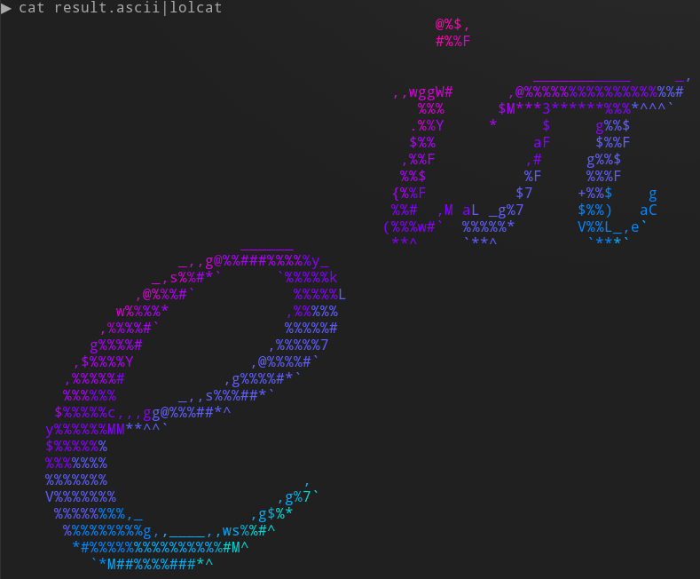

img2ascii
===

Convert images to beautifully crafted ASCII art using the power of neural networks. All the fancy stuff / hard work is done in [ascii-net](https://github.com/wahtak/ascii-net) by [@wahtak](https://github.com/wahtak).

Turn an image


into ASCII

```
                                                 @%$,
                                                 #%%F

                                                            ___________     _,
                                            ,,wggW#      ,@%%%%%%%%%%%%%%%%%#
                                               %%%      $M***3******%%%*^^^`
                                              .%%Y     *     $     g%%$
                                              $%%           aF     $%%F
                                             ,%%F          ,#     g%%$
                                             %%$           %F     %%%F
                                            {%%F          $7     +%%$    g
                                            %%#  ,M aL _g%7      $%%)   aC
                                           (%%%w#`  %%%%%*       V%%L_,e`
                           ______           **^     `**^          `***`
                    _,,g@%%###%%%%%y_
                 _,s%%#*`      `%%%%%k
               ,@%%%#`           %%%%%L
             w%%%%*             ,%%%%%
           ,%%%%#`              %%%%%#
          g%%%%#              ,%%%%%7
        ,$%%%%Y             ,@%%%%#`
       ,%%%%%#           ,g%%%%#*`
       %%%%%%       _,,s%%%##*`
      $%%%%%c,,,gg@%%%##*^
     y%%%%%%MM**^^`
     $%%%%%%
     %%%%%%%
     %%%%%%%                      ,
     V%%%%%%%                  ,g%7`
      %%%%%%%%,_            ,g$%*
       %%%%%%%%%g,,____,,ws%%#^
        *#%%%%%%%%%%%%%%%#M^
          `*M##%%%%###*^
```


For some extra fun, try piping the result through lolcat:



## Installation

### From Source

`git pull <this repo>`

`cd img2ascii`

`docker build -t img2ascii:latest .`

## Usage

Put all the images you want to asciify in a folder at `/path/to/images` (Protip: use only one image or you'll have a hard time finding results other than the last one. Output is pretty messy).

Then run

`docker run --rm -t --env THRESHOLD=50 -v /path/to/images:/images img2ascii`

### Options

Change the **threshold** for the black/white conversion via the `$THRESHOLD` environment variable.

## TODO

- [ ] option to change output sizes
- [ ] variable number of optimization runs
- [ ] can i haz colors? <-- WARNING: This might result in some real work.
- [ ] It's 2017, so give me a goddamn Webinterface. And a REST-API
- [ ] ok but don't you think we should start with writing the result to a file instead of stdout?

# Disclaimer

[I read Turing's 1936 paper on computing and a page of Javascript example code and guessed at everything in between](https://xkcd.com/1833/). If this code breaks anything or annoys your cat, don't blame me. Please :)

This repo is just my 2 lines of glue code. All credit goes to [ascii-net](https://github.com/wahtak/ascii-net) by [@wahtak](https://github.com/wahtak)

